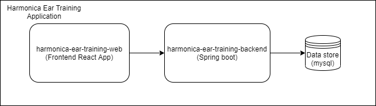

# Harmonica Ear Training Application

It consists of web and backend modules

Web module is a react application

Backend module is a spring-boot application


React app created with below command

```
npx create-react-app harmonica-ear-training-web
```

To work with react application

```
cd harmonica-ear-training-web
npm start
```

For Development environment the proxy is setup from react:

this starts react application at 

for dev: http://localhost:3000



React app is bundled in spring-boot application 

To build production use below command

```
mvn install -Pprod

cd harmonica-ear-training-backend

mvn spring-boot:run

```
For deploying on AWS Elastic Beanstalk, port needs to be configured with 5000

for Prod: http://localhost:5000


The jar can then be deployed in AWS Elastic Beanstalk

Elastic Beanstalk is a PaaS offering from AWS

We can upload the spring-boot app and get it up in minutes.


The screenshots can be seen under screenshots_aws folder

the application can be opened from :

http://harmonicaeartraining-env.qvp343kmiz.us-east-1.elasticbeanstalk.com/


### Connecting to AWS RDS 

1. First create DB with AWS RDS MySQL
   Code to create AWS RDS MySQL DB can be found [here](https://github.com/goutamsh/harmonica-ear-training/blob/master/harmonica-ear-training-backend/src/main/java/com/gshepur/harp/aws/CreateDB.java)
   
2. Go to security group under the AWS RDS database and edit inbound traffic to accept connection to MySQL at port 3306 from anywhere.

3. Get the hostname and port from the RDS console and use it in java application along with username and password

4. The point 3 can also be used to connect from any MySQL Client.

5. Install Java in AWS EC2 : https://dzone.com/articles/installing-java-8-on-aws-ec2-amazon-linux-instance


   


### References:

1. Springboot + JWT : https://medium.com/swlh/spring-boot-security-jwt-hello-world-example-b479e457664c

2. https://www.callicoder.com/spring-boot-spring-security-jwt-mysql-react-app-part-2/

3. React + User registration : https://jasonwatmore.com/post/2017/09/16/react-redux-user-registration-and-login-tutorial-example

4. AWS RDS MySQL connection : https://www.baeldung.com/aws-aurora-rds-java


      
      
